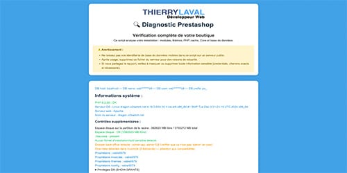

# 

## Auteur

👤 **Thierry LAVAL** — [Contact](mailto:contact@thierrylaval.dev)

* Github : [@Thierry Laval](https://github.com/thierry-laval)
* LinkedIn : [Thierry Laval](https://www.linkedin.com/in/thierry-laval)
* Site Web : https://thierrylaval.dev

---

## 📑 Table des matières

- 
  - [Auteur](#auteur)
  - [📑 Table des matières](#-table-des-matières)
  - [📎 Projet](#-projet)
  - [Description](#description)
    - [🎯 Pourquoi ce script ?](#-pourquoi-ce-script-)
      - [🔁 Fonctionnement](#-fonctionnement)
  - [Prérequis](#prérequis)
  - [Installation \& utilisation](#installation--utilisation)
  - [Sécurité](#sécurité)
  - [Pour les développeurs](#pour-les-développeurs)
    - [Fonctions utiles](#fonctions-utiles)
    - [Idées d’amélioration](#idées-damélioration)
  - [Contribution](#contribution)
  - [Licence](#licence)
  - [Soutien](#soutien)
      - [♥ Love Markdown](#-love-markdown)

---

## 📎 Projet

Création d’un outil de diagnostic complet pour installations PrestaShop (1.7 → 9.x)

_`Début du projet le 14/01/2025`_ — Version du script : 1.0.0 (25/10/2025)

---

## Description

Ce dépôt contient un script PHP autonome permettant d’effectuer un diagnostic complet d’une installation PrestaShop. Il vérifie la configuration PHP, les extensions, la connexion à la base de données, les modules, les thèmes, les permissions, les fichiers critiques, les overrides, le core (/vendor) et propose un rapport HTML téléchargeable.

Le script n’effectue aucune modification non sollicitée, hormis l’activation temporaire du mode debug si possible, et propose des actions sûres (vidage du cache, rapport téléchargeable).

### 🎯 Pourquoi ce script ?

Suite à des erreurs de déconnexion MySQL et de requêtes trop volumineuses sous PrestaShop 9, ce script permet de générer rapidement un rapport à transmettre à l’hébergeur pour ajuster les paramètres.  

Il offre également un diagnostic complet de la boutique :

* Vérification de la version PHP et des extensions.
* Contrôle des modules et thèmes (présence et activation).
* Inspection des permissions et propriétaires des dossiers critiques.
* Vérification de l’intégrité du core (/vendor, fichiers essentiels, overrides).
* Détection des conflits d’override et vidage du cache.
* Génération d’un rapport HTML téléchargeable.

#### 🔁 Fonctionnement

* Récupération automatique des paramètres de connexion MySQL depuis `config/settings.inc.php`.
* Vérification de la version PHP, des extensions requises et des variables critiques côté serveur.
* Analyse des modules et thèmes : comparaison base de données vs fichiers physiques.
* Contrôle des dossiers critiques, permissions et fichiers essentiels.
* Détection des conflits d’override de classes.
* Vidage du cache (`/var/cache/prod`, `/var/cache/dev`) si nécessaire.
* Génération d’un rapport HTML lisible avec alertes et recommandations (OK ✅ / Problème ⚠).

---

## Prérequis

* PHP 8.2+ recommandé  
* Accès à la base de données MySQL de PrestaShop 1.7+ / 9  
* Identifiants de connexion disponibles dans `config/settings.inc.php`  

---

## Installation & utilisation

1. Copier le fichier `diagnostic-prestashop.php` à la racine de l’installation PrestaShop.
2. Accéder à la page via un navigateur (ex. `https://votre-site.tld/diagnostic-prestashop.php`).
3. Lire les avertissements affichés.
4. Utiliser le bouton **Télécharger le rapport HTML** pour récupérer un export complet.
5. Supprimer immédiatement le script du serveur après usage (sécurité).

> **Remarque :** Certaines vérifications (connexion DB, SHOW GRANTS, lecture des fichiers vendor/composer) nécessitent les bonnes informations d’accès et les permissions de lecture/exécution appropriées.

---

## Sécurité

* Ne laissez jamais ce script (ou tout script contenant vos identifiants DB) sur un serveur public après utilisation.
* Masquez ou retirez toute information sensible avant de partager un rapport.
* L’activation du mode debug est réalisée uniquement si le script peut modifier `config/defines.inc.php`. Conservez une sauvegarde avant modification.

---

## Pour les développeurs

### Fonctions utiles

* `check($condition, $message_ok, $message_fail, $class_ok = 'ok', $class_fail = 'fail')` — affichage conditionnel.
* `rmdir_recursive($dir)` — suppression récursive pour vider le cache.

### Idées d’amélioration

* Installation automatique d’une base de données pour tests locaux.
* Ajout d’un mode "safe" qui n’écrit jamais sur le disque.
* Export JSON/CSV des résultats pour intégration CI/CD.

---

## Contribution

Les contributions sont les bienvenues !

* Fork → nouvelle branche → commit → pull request.  
* Respectez les bonnes pratiques, tests et sécurité (ne pas committer les credentials).

---

## Licence

Ce projet est distribué sous licence MIT — voir le fichier LICENCE pour les détails.

Copyright © 2023–2025 Thierry Laval — https://thierrylaval.dev

---

## Soutien

Si ce projet vous aide, vous pouvez soutenir l’auteur :

[Voir mon travail](https://github.com/thierry-laval)

---

#### ♥ Love Markdown

Donnez une ⭐️ si ce projet vous plaît !

FAN DE GITHUB !

**[⬆ Retour en haut](#table-des-matières)**
